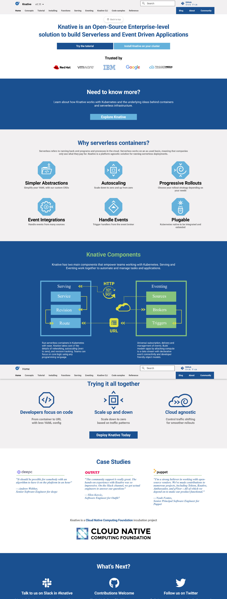
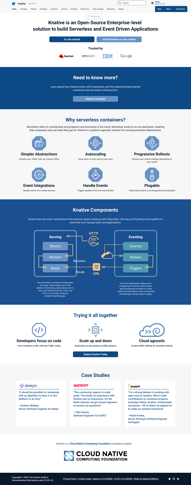

# List of first re-design fixes:

Aesthetic/usability changes:
- Swapping website colours to be in line with logo and to meet WCAG AAA (only non compliant one is the diagram which would be considered a graphical element)
- Adding consistent corner rounding 
- Small layout improvements including margins, closeness of two main cta buttons
- Hover colour adjustment for buttons. This is originally a purpleish colour that does not match the rest of the website. It changes to a darker blue
- Indicate case studies are clickeable through adding white boxes with small hover css animation

Content changes-
- Changed the second block of information (the one in the blue background) need to "Know more" button to "Knative Concepts" that will take you to the concepts page

## Current design:

## Proposed design:

