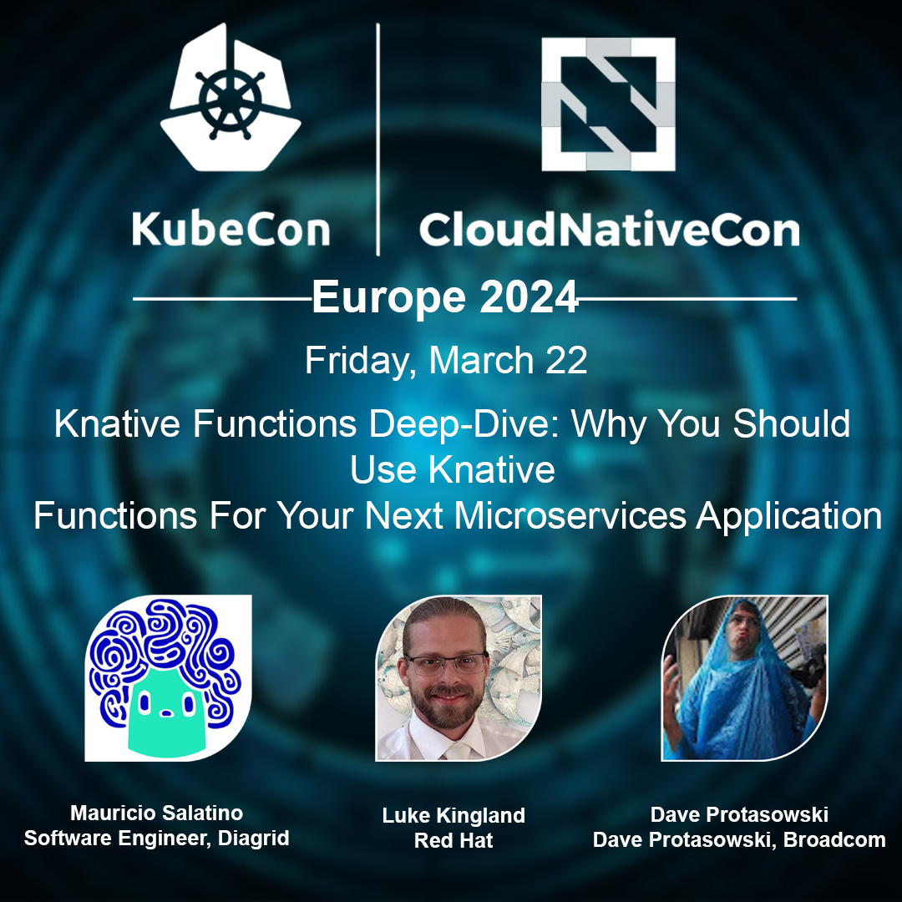
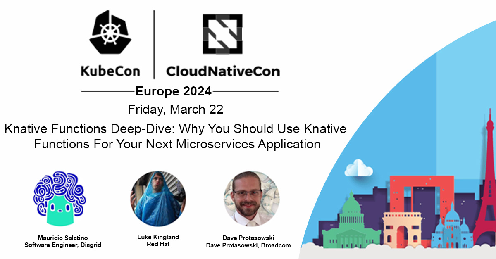

# Twitter post with Context 

🚀 Excited to announce the #Knative maintainer session at #KubeCon !

Join us for a deep dive into Knative Functions with Mauricio Salatino (@salaboy), Luke Kingland and Dave Protasowski (@lintinmybelly) for your next microservices application!

#

# Linkedin post with Context 

🚀 Excited to announce the Knative maintainer session at KubeCon Paris! Join us for a deep dive into Knative Functions with Mauricio (Salaboy) Salatino, Luke Kingland and Dave Protasowski.

🔍 Title: "Knative Functions Deep-Dive: Why You Should Use Knative Functions For Your Next Microservices Application"

Don't miss out on unlocking the power of Knative Functions! See you there! 

#KubeCon #Knative #Microservices #CloudNative #CNCF

