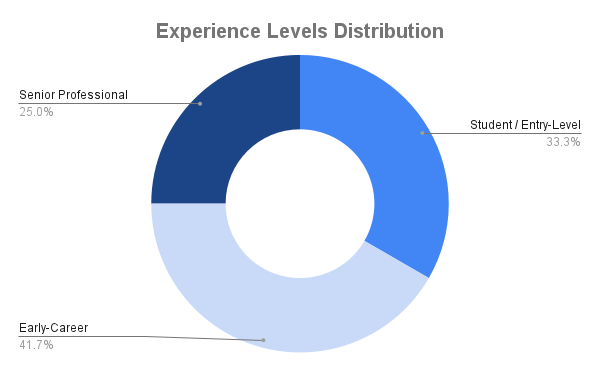
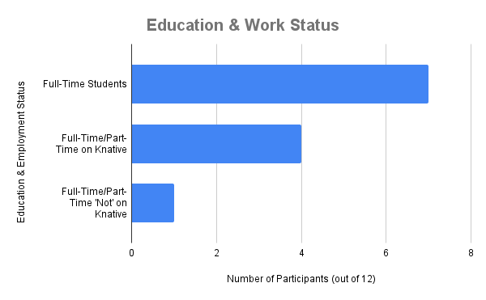
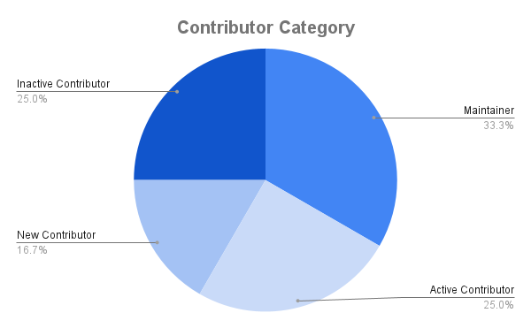
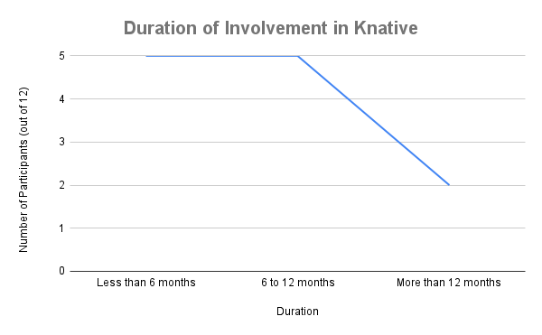

# Knative Contributor Research 2024

This directory contains the files and resources related to the project - [Knative: Contributor Journey Research](https://mentorship.lfx.linuxfoundation.org/project/54afaf17-4dc9-4783-9641-a95b5a33af9e). This project was undertaken by [Prajjwal Yadav](https://github.com/prajjwalyd) as an LFX mentee during the Spring 2024 term under the guidance of [Mariana Mejía](https://github.com/mmejia02) and [Calum Murray](https://github.com/Cali0707).

The project aims to identify challenges in the current contributor journey and understand the reasons behind sustained engagement and disengagement within the Knative community. The main goal is to suggest actionable recommendations to improve the overall developer experience in Knative, encouraging long-term engagement.

**For more information about this project, please read [Introduction.md](Introduction.md).
The key findings of this research can be found [here](Key-Findings.md).
The suggested actionable recommendations based on the key findings can be found [here](Recommendations.md).**

## Table of Contents

1. [Methods Used](#methods-used)
2. [Demographics](#demographics)
3. [Limitations and Future Work](#limitations-and-future-work)
4. [Resources & Bibliography](#resources--bibliography)
5. [Closing Thoughts](#closing-thoughts)

## Methods Used

To generate this report, we employed a variety of methodologies, most of which were successful. 

The main methods used were:

- **Data-driven Sampling**: We employed a data-driven approach to identify a potential user sample based on Knative's contribution data. The primary data source was the [contributors.json](https://github.com/aliok/knative-contrib-report/blob/main/250-build-contributor-list/contributors.json) file. From this file, we extracted the study sample and performed further classifications.
- **1-on-1 Interviews**: A total of 12 individual interviews, each approximately 30 minutes long, were conducted with current and past members of the Knative community. These interviews included active contributors, new contributors, maintainers, and inactive contributors. The qualitative data from these interviews was analyzed using the affinity mapping technique to identify common themes and insights. Additionally, some tree diagrams were utilized for root cause analysis to further understand the underlying issues. 
- **Comparative Analysis**: We identified some successful strategies employed by other open-source projects to improve developer experience and contributor retention. Specific examples are included in the [Recommendations.md](Recommendations.md) file.
- **Onboarding Review**: Contributor onboarding and its associated challenges were a central focus of this research. We effectively identified key areas of concern ([Onboarding Difficulties](Key-Findings.md#onboarding-difficulties)) within the current contributor journey through interviews and provided actionable recommendations based on these findings ([Improving the Onboarding Process](Recommendations.md#improving-the-onboarding-process)).
- **Literature Review**: Although not the primary method, we did read some existing literature on open-source community engagement and participation. The goal was to learn from these studies to better plan our research.
- **Surveys**: A developer survey was designed for the Knative community to explore motivations, engagement, challenges, and potential improvements. However, this methodology was not very successful or statistically significant, with only four individual responses (as of May 28, 2024). This survey can still serve as a reference for future efforts in the community. 
- **Focus Groups**: This methodology was initially planned but could not be implemented due to time constraints.

## Demographics

The primary data source of this research was the 12 interviews that were conducted within the Knative community. These interviews included active contributors, new contributors, maintainers, and inactive contributors. We analyzed contributor data from January 1, 2023, to February 29, 2024, and categorized each contributor based on their frequency of contributions:

- **New Contributors**: Contributors who made their first contribution in the last couple of months.
- **Active Contributors**: Contributors with at least one contribution each month.
- **Inactive Contributors**: Contributors with no contributions in the last couple of months.
- **Maintainers**: Individuals responsible for maintaining code in the Knative repositories.

This categorization was based on analyzing the GitHub contribution graphs of each individual contributor.

From this contributor data (from January 1, 2024, to February 29, 2024), we identified prospective participants from each of the four categories and approached them on Slack to schedule one-on-one interviews.

> When examining data from January 1, 2023, to December 31, 2023, we found that a total of 120 contributors made their first commit in 2023, of whom 8 are still contributing actively. Although we do not have an exact retention rate to compare against, it is evident that there is room for improvement in contributor retention.

Since the Participants varied in their experience levels, current roles, and levels of engagement with the project, here is some rough demographic data presented in table form:

| **Category**                         | **Number of Participants** (out of 12) |
|--------------------------------------|---------------------------------------|
| **Experience Levels**                |                                       |
| Students/Entry Level                 | 4                                     |
| Junior Professionals                | 5                                     |
| Senior Professionals                 | 3                                     |
| **Education and Work Status**        |                                       |
| Full-Time Students* | 7   |
| Full-Time/Part-Time on Knative       | 4                                     |
| Full-Time/Part-Time 'Not' on Knative | 1                                     |
| **Contributor Categories**           |                                       |
| Maintainers                          | 4                                     |
| Active Contributors                  | 3                                     |
| New Contributors                     | 2                                     |
| Inactive Contributors                | 3                                     |
| **Duration of current (or past) involvement in Knative****|          |
| Less than 6 months                   | 5                                     |
| 6 to 12 months                       | 5                                     |
| More than 12 months                  | 2                                     |

`*` Some full-time students indicated that they were also working while studying.
`**` Duration of involvement at time of the interview.

## Limitations and Future Work

This work was completed within the 12-week timeframe of the LFX mentorship program, which imposed obvious time constraints. Additionally, there was a lack of participation in the developer survey, which limited the breadth of quantitative data. Despite these challenges, we successfully conducted 12 interviews with a diverse group of candidates, forming the backbone of this research.

### Limitations

- **Time Constraints**: The 12-week period was insufficient to explore all potential methodologies and data sources fully.
- **Survey Participation**: The developer survey had very low participation, which limited its statistical significance.
- **Contributor Categorization**: Our categorization of contributors was based solely on quantitative data (number of GitHub contributions). This approach did not account for other types of participation, such as interactions on Slack, attending meetings, providing feedback, and more. However, our interview questions did cover aspects of community involvement and interactions.
- **Data Analysis**: The qualitative interview data was analyzed using affinity mapping and root cause analysis. While these methods were effective, we believe that some further analysis of the extensive interview data could potentially yield additional insights and recommendations.

> The key findings of this research emerged from the themes identified during our analysis. For each theme, we crafted specific, actionable recommendations that are practical and feasible within our organizational context. These recommendations are prioritized in descending order of implementation priority based on our findings.

### Future Work

- **Implementation and Evaluation**: The next step is to implement the actionable recommendations and evaluate their effectiveness. This iterative process may involve trials and errors to determine what works best.
- **Further Research**: Conduct follow-up research after a sufficient time interval post-implementation of the recommendations to evaluate their effectiveness and impact on the overall developer experience.
- **Data Collection**: Future efforts should aim to gather data from diverse sources, including increased survey participation, focus groups, and more.

> Despite the mentioned limitations, the data collected from the interviews was substantial and diverse. Notably, connecting with three inactive contributors provided valuable insights. The next phase will focus on implementing the recommendations and assessing their success in improving the developer experience within the Knative community!

## Resources & Bibliography

### Research Resources
- [contributors.json](https://github.com/aliok/knative-contrib-report/blob/main/250-build-contributor-list/contributors.json)
- [Interview Questions](https://docs.google.com/document/d/16uqV_zltMGxsveRPMImqM4oeBREW87ZeRU3Jz1zveto/edit?usp=sharing)
- [Interview Data Analysis](Figjam-Link)
- [Knative Developer Survey](https://forms.gle/JHPhbYtWBWoLwmHs6)

### Literature Studied:
*Note: The literature review was not the primary methodology but provided valuable context and background to inform the research design.*

- **What brings you to open source?** *Author: Sophia Vargas, Researcher, Open Source Programs Office Google*
-  **Why do People Give Up FLOSSing? A Study of
Contributor Disengagement in Open Source.** *Author: Courtney Miller (New College of Florida, USA), David Widder (Carnegie Mellon University, USA), Christian Kastner (Carnegie Mellon University, USA), and Bogdan Vasilescu (Carnegie Mellon University, USA)*
- **Are You Still Working on This? An Empirical Study on Pull Request Abandonment**
*Author: Zhixing Li, Yue Yu, Tao Wang, Gang Yin, ShanShan Li, and Huaimin Wang*
- **Beyond the Repository** *Author: AMANDA CASARI, JULIA FERRAIOLI, AND JUNIPER LOVATO*

## Closing Thoughts

<!--work in progress-->