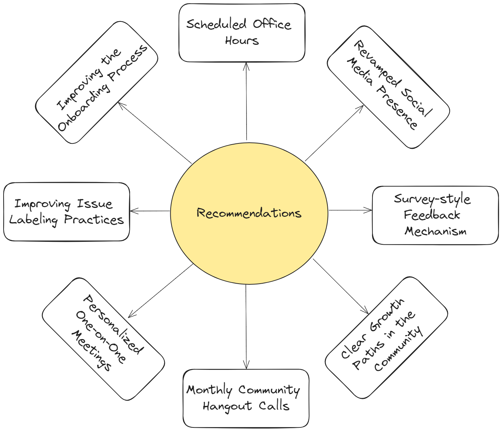

# Recommendations

Based on what we've learned from our research, we strongly suggest putting these recommendations into action. These recommendations aim to make things better for people who contribute to the Knative community. The main goal is to create a dynamic and participatory environment that encourages sustained engagement over time.

## Table of Contents
- [Improving the Onboarding Process](#improving-the-onboarding-process)
- [Improving Issue Labeling Practices](#improving-issue-labeling-practices)
- [Scheduled Office Hours](#scheduled-office-hours)
- [Revamped Social Media Presence](#revamped-social-media-presence)
- [Monthly Community Hangout Calls](#monthly-community-hangout-calls)
- [Establishing Clear Growth Paths in the Community](#establishing-clear-growth-paths-in-the-community)
- [Personalized One-on-One Meetings for New Contributors](#personalized-one-on-one-meetings-for-new-contributors)
- [Anonymous Feedback Mechanism](#anonymous-feedback-mechanism)

## Improving the Onboarding Process
	
- ### Establishing a Structured Onboarding Plan
	-  	This plan should include comprehensive introductory documentation, guides, tutorials, and links to all other necessary resources. This approach allows new contributors to seamlessly integrate themselves into the project with minimal friction.
	- 	Consolidating this plan into a centralized hub, such as a digital book or repository, would provide immense value for new contributors. Perhaps we can include this 'centralized resource' in the issue templates to make it easier to find, especially for newcomers.

- ### Video tutorials & Visual Guides
	- Creating detailed video tutorials for setting up Knative projects on popular operating systems like Linux/WSL and macOS is essential for new contributors. 
	- These tutorials would provide step-by-step instructions for installation and configuration, along with an overview of different components and directories. 
	- Visual guides (diagrams, flowcharts, etc.) to simplify understanding and empower contributors to overcome initial hurdles more effectively.

- ### Clear Communication of Expectations
	- PR Guidelines: Clearly communicate expectations for pull requests (PRs). This includes providing a detailed guide on the PR process, common review criteria, and typical feedback cycles.
	- By setting clear expectations upfront, new contributors will be better prepared for the collaborative nature of open-source contributions, reducing the likelihood of feeling overwhelmed by feedback on their initial submissions.

#### Why is it needed?

- **Reducing Initial Setup Frustration:** Many new contributors face significant challenges during the initial setup phase, which can lead to frustration and potentially abandoning the project. Comprehensive onboarding resources, including video tutorials and visual guides, provide a guided approach to help them navigate this phase confidently.

- **Empowering New Contributors:** Beginner-friendly resources and documentation are particularly crucial for those new to Knative and cloud-native technologies like Docker and Kubernetes. Structured and accessible onboarding materials help these individuals to understand the project and make meaningful contributions without facing significant challenges.

- **Sustaining Engagement:** Clear communication of PR expectations helps maintain contributor engagement by preparing them for the iterative feedback process, reducing frustration and encouraging continuous involvement.

#### Implementation:
1. Establishing a Structured Onboarding Plan:
	- Content Creation: Create comprehensive documentation, guides, and tutorials covering all important aspects of the project. Review and update the existing material for each Knative component.  
	- Centralized Hub: Develop a centralized accessible resource or digital book (something similar to the [Layer5 Community Handbook](https://layer5.io/community/handbook)) to consolidate all important community and onboarding materials.
	- Integration: Include links to the centralized resource in issue templates for easy access. Also, showcase this on knative.dev to increase visibility.
	-  Quality Testing and Improvements: Regularly evaluate the onboarding plan with experienced community members and gather feedback from new contributors, using their insights and suggestions to enhance the process.
2. Comprehensive Video Tutorials:
	- Video Production: Produce detailed video tutorials for setting up Knative projects on popular operating systems.
	- Content Coverage: Ensure the tutorials cover installation, configuration, and an overview of project directories and components.
	- Distribution: Upload the videos to YouTube and embed them in relevant documentation.
3. Clear Communication of Expectations:
	- Guideline Creation: Develop clear guidelines for pull requests (PRs), including expectations, timeline, and iterative review processes.
	- Documentation: Document the PR process and expectations in the contributing guidelines.

## Improving Issue Labeling Practices

- Actively identify and label more issues as 'good first issue' and 'help wanted'. This involves breaking down larger tasks into smaller, manageable chunks that are suitable for newcomers. 
- Enhance the clarity and descriptiveness of issue labels to provide more context about the issue's nature, priority, specific area of consideration, and complexity.
- Develop a standardized process for labeling issues. This process should include guidelines on when and how to use each label. Maintainers and regular contributors are expected to follow this process to ensure consistency.

#### **Why is it needed?**

- **Ease of Entry for New Contributors:** Currently, new contributors often struggle to find appropriate entry-level issues, which can delay their engagement and lead to frustration. More 'good first issue' and 'help wanted' labels will provide a clear starting point, reducing the need for them to seek guidance from maintainers.
- **Encouraging Independent Exploration:** By having more clearly labeled issues, new contributors can independently identify tasks they are comfortable working on, fostering a sense of autonomy and confidence.
- **Attracting and Retaining Contributors:** An organized and beginner-friendly issue tracker can attract more contributors to the Knative community. It signals that the project is welcoming to newcomers and provides a supportive environment for learning and contributing.
- **Efficiency for Maintainers:** Improved labeling practices help maintainers by reducing the number of inquiries from new contributors about where to start. Combined with organized onboarding, this enables maintainers to concentrate more on reviewing contributions and offering guidance on more complex issues.

#### Implementation:
- Label Identification: Identify and label more issues as 'good first issue' and 'help wanted'. This may include breaking down of bigger tasks into smaller manageable chunks suitable for beginners.
- Label Description: Enhance the clarity and descriptiveness of issue labels to provide more context so that contributors get an idea of what they are dealing with.
- Standardized Process: Develop a standardized process for labeling issues and train maintainers and contributors on its usage. Encourage every maintainer to create more beginner-friendly issues regularly to ensure a continuous supply.

## Scheduled Office Hours

- Regular Sessions: Schedule weekly office hours at consistent times to provide a reliable opportunity for contributors to seek help. Ensure that these sessions are well-publicized and open to all contributors, seeking guidance and mentorship or facing challenges while contributing. 
- Diverse Mentorship: Rotate the hosts for these sessions among different maintainers and experienced contributors to provide diverse perspectives and expertise. This also helps distribute the mentoring load and gives attendees the chance to interact with various members of the community.

#### **Why is it needed?**

- **Comfortable Environment:** Some contributors may feel uncomfortable asking questions in public forums or Slack channels due to fear of judgment or just lack of confidence. Office hours provide a more supportive environment where they can seek help without hesitation.
- **Immediate Support:** Real-time interaction during office hours allows contributors to get immediate feedback and solutions to their problems, reducing delays and enhancing productivity.
- **Community Building:** Regular interactions through office hours foster a stronger sense of community and collaboration. Contributors get to know each other and build relationships, which can lead to more effective teamwork and knowledge sharing.
- **Adoption by Other Projects:** Many successful open-source projects have adopted office hours as a best practice to enhance collaboration and support.

#### Implementation:
- Scheduling: Establish a regular schedule for weekly office hours at convenient times for contributors.
- Duration: Start with a 30-minute weekly call and increase it over time if demand requires.
- Promotion: Publicize the office hours through various channels such as Slack and social media.
- Session Host: Have 1 or 2 maintainers present in a single session, rotating the hosting responsibilities every week to prevent anyone from feeling burdened.

## Revamped Social Media Presence
- A more assertive social media strategy amplifies Knative's visibility and attracts a wider audience of potential contributors. 
- Focus on showcasing success stories, case studies, technical achievements, and upcoming events to capture the interest of developers and technologists who may not be familiar with the project.
- Platforms to target: LinkedIn, YouTube, and X (Twitter)
- ### Few More Suggestions:
	- Project Kick-off Meetings: Host live streams or recorded meetings for each major feature or release. These sessions can serve as both informative and promotional content, allowing the community to stay updated and engaged with ongoing developments.
	- Gamification of Contributions: Introduce gamification elements such as rankings, badges, certificates and even an ambassador program to recognize and reward active contributors. These elements can incentivize engagement and provide tangible acknowledgments of contributors' efforts, enhancing their professional profiles. Share these achievements across all social media platforms to reach potential new contributors (For example, we could use a system like [Nirmata Badges](https://www.credly.com/organizations/nirmata/badges) and include specific badges such as 'Knative Eventing Contributor', 'Knative Serving Contributor', etc. as per our requirements).
	- Podcasts: Launch a podcast series featuring fireside chats on different topics and personal stories from contributors about their journeys and experiences with Knative. Highlight diverse experiences and the career benefits of participating in open-source projects. These stories can inspire newcomers and demonstrate the impact of contributing to open source and Knative. Include guest speakers from the wider open source community (similar to [kubernetespodcast.com](https://kubernetespodcast.com/about/index.html)).

#### **Why is it needed?**

- **Increased Visibility:** A more assertive social media presence will raise awareness of Knative among potential contributors who might otherwise be unaware of the project. This proactive approach can help attract new talent and broaden the community.
- **Engagement and Interest:** By creating high-quality, engaging content tailored for the developer community, Knative can generate more valuable interactions and sustained interest. Social media is a powerful tool for outreach, as evidenced by current contributors who discovered Knative through these channels.
- **Community Building:** Podcasts, live streams, and gamification not only provide information but also build a sense of community and belonging. Recognizing contributors' efforts publicly can motivate ongoing participation and loyalty.
- **Professional Development:** Highlighting personal stories and journeys would make new contributors aware of the individual journeys of many maintainers and active contributors. This might make them feel relatable and more confident, and they would also come to know about the benefits of participating in Knative as a noteworthy addition to their careers.

#### Implementation:
- Content Strategy Development: Develop a robust content strategy highlighting success stories, technical achievements, and upcoming events. Include tutorials and educational content to add value. Use a content calendar to plan posts, ensuring a consistent mix of articles, videos, and live streams.
- Platform Selection and Optimization: Target platforms—LinkedIn, YouTube, and Twitter (X). Optimize profiles with up-to-date information and branding. On LinkedIn, engage with professional groups. On YouTube, organize content into playlists and upload regular videos and live streams. Use Twitter for quick and short updates to maximize reach.
- Content Creation:Produce high-quality, platform-specific content. Create step-by-step video tutorials, contributor interviews/podcasts, and live streams for big updates. Write in-depth articles, community stories, and guides. Regularly post updates on milestones, use interactive content like polls, and visually engaging posts.
- Promotion and Engagement: Increase the follower base and interaction through cross-promotion with other projects and influencers. Share content across all platforms and encourage contributors to do the same if they find it helpful. Actively participate in industry events and conferences, run interactive contests, challenges, and hackathons to foster engagement.
- Gamification Implementation: Develop and integrate gamification elements such as badges, certificates, and rankings into the Knative contribution process. Use platforms like [Credly](https://info.credly.com/) for badge issuance and display these achievements prominently on social media.
- Analytics and Improvement: Monitor and analyze social media performance regularly. Set KPIs such as follower growth, GitHub Stars, and engagement rates. Use platform analytics tools to track success. Adjust content strategy based on performance data to keep the approach dynamic.

## Monthly Community Hangout Calls
- While formal working group meetings are essential for project progress, hangout calls offer a more relaxed setting for networking and socializing, fostering stronger community bonds.
- Organize interactive activities such as trivia, Q&A sessions, and games. These activities can be both fun and educational, encouraging more relaxed and informal interactions.
- These sessions provide an opportunity for individuals to share their experiences, tips, and tricks, enriching the community's collective knowledge base.

#### **Why is it needed?**

- **Fostering Community Bonds:** Interactive and informal activities are crucial for building a sense of community. They provide a space where contributors can get to know each other beyond the scope of their work, fostering a more supportive and collaborative environment.
- **Enhancing Engagement:** Monthly hangouts can keep contributors engaged and motivated. By offering a variety of activities and discussions, these sessions can cater to different interests and needs, making the community more dynamic and inclusive.
- **Encouraging Casual Interactions:** Formal meetings can sometimes be intimidating, especially for new contributors. Informal hangouts create a welcoming atmosphere where everyone feels comfortable participating and sharing their thoughts.
- **Building Relationships:** Strong relationships within the community lead to better teamwork and collaboration. When contributors feel connected and valued, they are more likely to remain active and committed to the project! 

#### Implementation:

- Scheduling: Set a regular schedule (e.g., the last Friday of every month) for consistency. Use community polls to choose the most convenient time for the majority of contributors across different time zones.
- Promotion: Publicize the hangout sessions through multiple channels, including Slack, community forum, and social media, to ensure maximum participation.
- Duration: The calls should be sufficiently long, at least one hour, to allow for meaningful interaction and a variety of activities.
- Themed Activities: Each call can have a theme and pre-planned list of interactive activities.

## Establishing Clear Growth Paths in the Community

- Structured Growth Framework: Review and showcase a clear, transparent framework outlining the various stages of contributor growth within the community. This framework should be accessible and should include milestones, criteria, and expectations for advancement.

- Skills Development Tracks: Offer specialized tracks for different areas of contribution, such as coding, documentation, community management, and user experience. Each track should outline specific skills and knowledge areas to be developed at each stage of progression.
- Personalized Development Plans: Encourage contributors to set personal goals aligned with their interests and aspirations within the community. Provide guidance and resources to help them achieve these goals, whether it's mastering a new technology, leading a project, or becoming a maintainer/mentor.
- Recognition and Rewards: Recognize and celebrate contributors' achievements as they progress along their growth paths. 

#### **Why is it needed?**

- **Motivating Contributors:** Clear growth paths provide contributors with a sense of purpose and direction, motivating them to actively participate and contribute to the community. When contributors see a clear path for advancement, they are more likely to invest their time and energy into their involvement.
- **Guiding Development:** Structured growth frameworks help contributors identify areas for skill development and track their progress over time. This guidance ensures that contributors are continuously growing and evolving within the community.
- **Building Long-Term Engagement:** By offering clear pathways for growth, the community can retain contributors over the long term. When contributors feel supported and valued, they are more likely to remain engaged and committed to the project. This will also distribute the load on current maintainers who are suffering from low retention rates.
- **Attracting New Talent:** A well-defined growth framework can attract new contributors by showcasing opportunities for personal and professional development within the community. This can help expand the talent pool and bring fresh perspectives and ideas to the project, leading to the next phase of Knative with new maintainers and contributors.

#### Implementation:
- Update/Develop Framework: Define milestones and criteria for contributor growth within the community to motivate new contributors. 
- Offer Tracks: Identify key areas and provide skill development tracks across different aspects of Knative.
- Encourage Goals: Educate on goal setting and facilitate mentorship to help contributors achieve their personal development plans.
- Recognition: Design a recognition program for achievements at each level to celebrate and motivate contributors.

## Personalized One-on-One Meetings for New Contributors
- Provide new contributors with the option to have one-on-one meetings with trusted community members or maintainers. These meetings should be short and focused, offering personalized support and guidance tailored to the new contributor's needs.
- These initial interactions help establish trust and rapport, making new contributors feel valued and supported. This personal touch can make a significant difference in their comfort level and confidence.
- The goal of these one-on-one meetings is to provide initial support and gradually encourage new contributors to participate more publicly in the community. Over time, as they become more familiar and comfortable, they will be more inclined to engage with a broader group of contributors.

#### **Why is it needed?**

- **Perception of Limited Community Interaction:** New contributors often perceive the community as being comprised of only one or two individuals they are most comfortable with. By facilitating personalized meetings with these 'trusted' members, we can help new contributors expand their network within the community.
- **Enhanced Comfort and Engagement:** Personalized support helps newcomers feel more comfortable asking questions and seeking guidance. As they build confidence, they are more likely to engage publicly, fostering a more inclusive and active community.
- **Expanding Networks:** Encouraging interactions with multiple community members helps new contributors get to know more individuals, broadening their support network and enhancing their sense of belonging.

#### Implementation:
- A contributor reaches out to a maintainer they trust, possibly seeking help or explicitly requesting a one on one meeting.
- While not mandatory, maintainers may also arrange meetings with contributors who seek significant assistance through direct messages.
- Utilize scheduling tools like [Calendly](https://calendly.com/) to coordinate convenient meeting times for both parties.
- During the initial meeting, maintainers should aim to understand the new contributor’s interests, goals, and immediate challenges. They may also provide an overview of the project and essential resources to facilitate their integration.
- If additional support is needed, schedule follow-up meetings to address further queries and monitor the contributor’s progress. Gradually encourage their participation in public channels and group meetings.
- Maintaining confidentiality throughout these interactions is crucial to ensure contributors feel comfortable sharing their concerns.

## Anonymous Feedback Mechanism
- **Anonymous Surveys:** Create a survey platform where contributors can anonymously provide feedback, share insights, and suggest improvements in the developer experience.
- **Regular Review and Action:** Establish a process for regularly reviewing the feedback collected through the survey platform. Use this feedback to identify areas for improvement and implement changes to address the community's needs and priorities.
For example, new contributors after their onboarding can be encouraged to share their insights and experiences by participating in an anonymous survey.
- **Transparent Communication:** Communicate the changes and improvements made in response to the feedback. Transparency in how feedback is used will encourage more contributors to participate in the feedback process.

#### **Why is it needed?**

- **Encouraging Candid Feedback:** An anonymous feedback mechanism allows contributors to share their thoughts and suggestions without fear of judgment or repercussions. This leads to more honest and valuable insights.
- **Targeted Community Improvements:** By gathering comprehensive feedback, the community can better understand its needs and priorities, facilitating targeted improvements that enhance the overall experience for all contributors.
- **Fostering Inclusivity:** Regularly acting on feedback demonstrates a commitment to inclusivity and continuous improvement. It shows that the community values the input of all contributors and is dedicated to creating a supportive and inclusive environment.

#### Implementation:
- Survey Creation: Set up an anonymous survey platform. The UX Working Group can be in charge of designing and maintaining the survey.
- Promotion: Promote the survey through community channels and encourage participation.
- Analysis and Action: Regularly review the feedback collected and take action on actionable suggestions and concerns.
- Communication: Share updates on the changes and improvements made in response to the feedback to ensure transparency and encourage ongoing participation.