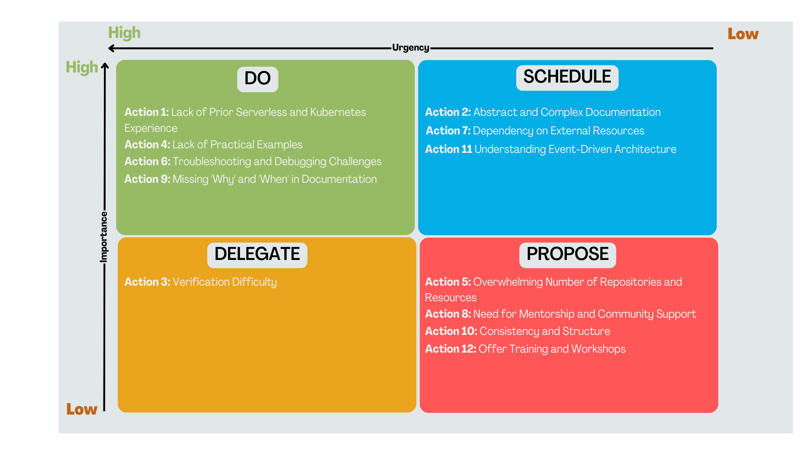

## 5. Findings of the Research

This section presents a comprehensive analysis of the key findings derived from both interview insights and survey results. The identified pain points have been carefully categorized based on their source, and corresponding actionable items have been proposed. To prioritize these actions, an Eisenhower Matrix has been employed, organizing tasks based on their urgency and importance.

---

### 5.1. Combined Analysis of Pain Points and Actions

#### 5.1.1. Lack of Prior Serverless, Kubernetes, and Docker Experience
- **Source**: Identified in both interviews and survey responses.  
- **Issue**: Users encountered difficulties with Knative Eventing due to a lack of prior experience with serverless technologies and Kubernetes.  
- **Action**:  
  - Add a section in the documentation that clearly states the importance of Kubernetes and Docker knowledge.
  - Provide links to existing Kubernetes learning resources to support the users' journey into Knative Eventing.

#### 5.1.2. Abstract and Complex Documentation
- **Source**: Identified in both interviews and survey responses.  
- **Issue**: The complexity and abstract nature of the documentation made it challenging for users.  
- **Action**:  
  - Simplify the language in the documentation.
  - Provide clear explanations of basic concepts.
  - Add a glossary of terms and frequently used jargon.

#### 5.1.3. Verification Difficulty
- **Source**: Identified in interviews.  
- **Issue**: Difficulty verifying the correct setup of Knative Eventing after installation.  
- **Action**:  
  - Create a simple example that installs a broker, a source, and an event display to verify the setup.
  - Develop tools or scripts to help users verify installations.
  - Include visual indicators or dashboards showing the status of components.

#### 5.1.4. Lack of Practical Examples
- **Source**: Identified in both interviews and survey responses.  
- **Issue**: Users struggled with the absence of practical, real-life examples in the documentation.  
- **Action**:  
  - Provide step-by-step tutorials and sample projects demonstrating the practical application of Knative Eventing.

#### 5.1.5. Overwhelming Number of Repositories and Resources
- **Source**: Identified in interviews.  
- **Issue**: The large number of repositories (70+) in the Knative organization was overwhelming, especially for beginners.  
- **Action**:  
  - Consolidate documentation and resources into a clear, structured path for beginners.

#### 5.1.6. Troubleshooting and Debugging Challenges
- **Source**: Identified in both interviews and survey responses.  
- **Issue**: Insufficient guidance in documentation for troubleshooting common issues.  
- **Action**:  
  - Enhance the troubleshooting section with detailed guides, common issues, and resolutions.
  - Include examples of error messages with explanations and resolutions.

#### 5.1.7. Dependency on External Resources
- **Source**: Identified in both interviews and survey responses.  
- **Issue**: Many users relied on external resources like YouTube or third-party guides.  
- **Action**:  
  - Curate and showcase high-quality external resources that complement official documentation.

#### 5.1.8. Need for Mentorship and Community Support
- **Source**: Identified in both interviews and survey responses.  
- **Issue**: Insufficient resources for self-guided learning.  
- **Action**:  
  - Move Q&A discussions from Slack to GitHub Discussions for a more permanent and searchable platform.
  - Encourage expert participation in answering beginner questions.

#### 5.1.9. Missing 'Why' and 'When' in Documentation
- **Source**: Identified in interviews.  
- **Issue**: Documentation lacked clarity on 'why' and 'when' certain configurations are beneficial.  
- **Action**:  
  - Include explanations of the reasoning behind different setups and configurations.
  - Provide guidance on appropriate scenarios for specific approaches.

#### 5.1.10. Consistency and Structure
- **Source**: Identified in both interviews and survey responses.  
- **Issue**: Inconsistent naming conventions and steps across resources.  
- **Action**:  
  - Standardize documentation structure and naming conventions.
  - Align the format with Kubernetes documentation for improved navigation.

---

### 5.2. Prioritization Using Eisenhower Matrix

The Eisenhower Matrix categorizes tasks based on urgency and importance:

#### High Urgency and Importance
1. Troubleshooting and Debugging Challenges  
2. Lack of Practical Examples  
3. Missing 'Why' and 'When' in Documentation  
4. Lack of Prior Serverless, Kubernetes, and Docker Experience  

#### High Importance but Low Urgency
1. Abstract and Complex Documentation  
2. Dependency on External Resources  
3. Understanding Event-Driven Architecture  

#### High Urgency but Low Importance
1. Verification Difficulty  

#### Low Urgency and Importance
1. Overwhelming Number of Repositories and Resources  
2. Need for Mentorship and Community Support  
3. Consistency and Structure  
4. Offer Training and Workshops  

This matrix provides a clear framework for prioritizing the actions needed to improve the Knative Eventing onboarding process, ensuring that the most critical pain points are addressed promptly, while less urgent issues are scheduled for later action.

---
